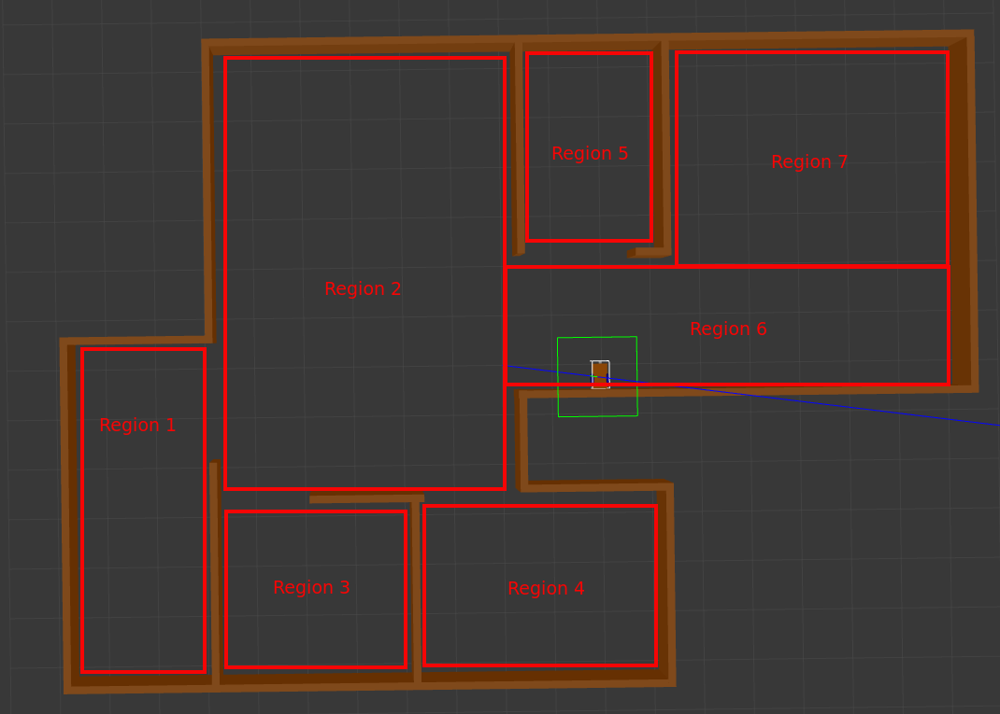
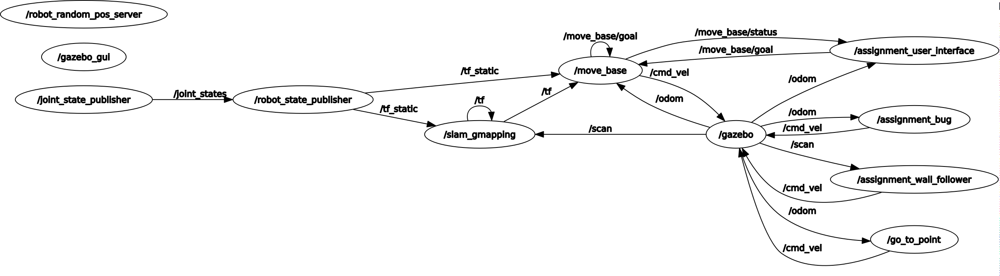

# Research Track I - Second Assignment
> The goal of this assignment is the development of a software architecture for the control of a mobile robot in a 3D enviroment simulation, done via Gazebo and rViz.

In particular we have used the ROS navigation stack (implements the move_base algorithm), the slam gmapping package, which was given, and another package called final_assignment. In the latter, we have developed the launch files, scripts and services, instead, all the other files (for example the 3D world, which is an empty apartment) were given.

## Implementation

### Robot Behaviors

The robot can navigate in the enviroment via three algorithms: 
<ul>
<li> move_base <li>
<li> bug0 <li> 
<li> wall follow <li>
</ul>

The first two permit to reach a point, avoinding obstacles in the meanwhile. Instead, the third one (wall follow) simply makes the robot follow the walls. 

Regarding move_base and bug0, the user can choose between four modes to set the coordinates of the target that the robot will reach:
<ul>
<li> manualPos <li>
<li> manualRandom <li> 
<li> autoPos <li>
<li> autorandom <li>
</ul>

**ManualPos** allows the user to insert the coordinates of one point between the following six:
(-4,-3), (-4,2), (-4,7), (5,-7), (5,-3), (5,1)

With **ManualRandom** the situation is a bit more complex, because, as the name suggests, the user can insert random coordinates in the interval x:[-5.9,5.9] y:[-8.3, 8.8]. The latter defines a rectangle which represents the internal perimeter of the flat. But, since this is a more complex geometric shape, we have divided it in seven regions, represented in the following image:



These permit to have the target point in a reachable zone for the robot.

In the **AutoPos** mode the target point is chosen randomly between the six points (described above). When the robot reaches the target, the user has a time of twenty seconds to stop the algorithm (writing the "Y" character followed by enter). If the timer expires or the user types "n" followed by enter, new coordinates (always between the possible six) are computed. This is repetated until the user stops it.

**AutoRandom** choose autonomously a target point inside one of the seven regions and iterates this until the user stops it, with the same method as above.

Instead, looking at the wall follow algorithm, it runs continously starting from the moment when the user selects it, until the one when the user inserts the character "q" followed by enter.

### Software Architecture

As we have already written above, the developed code is inside the final_assignment package. This is composed by five nodes, three services and two launch files. Let's see them in detail.

**robot_random_pos_server.py** is the service node that controls (if the user chooses one of the first two modes) or computes (if the user chooses one of the other two modes) the coordinates of the target position. In fact it implements the function *controlRegion(x, y)* in which it controls if a point is inside one of the seven regions.

The **RobotRandomPos.srv** is the custom service used by the above service node. It is composed by a request with fields: string *mode* (one of the four already cited) and two float32 (the coordinates inserted by the user if mode is one of the two manual, and otherwise zero). Its response has the same structure of the the request, so a string *result* ("ok" if the mode and the coordinates are correct and otherwise "errorn" where the n is a number that identifies which is the error) and two float32 (the resultant coordinates, either if them are right or wrong).

**assignment_wall_follow_service_m.py** is a node that implements the wall follow algorithm. This is done via a finite state machine with the four following states:
<ul>
<li> find the wall <li>
<li> turn left <li> 
<li> follow the wall <li>
<li> stop <li>
</ul>
It is also a publisher on topic */cmd_vel*, a subscriber to the topic */scan*, a client to the service */assignment_user_interface*. This client is used, in case that the variable *bug0_* is false (means that the algorithm is used alone and not from the bug0 algorithm), to send its state information to the user interface. As last thing, it is a server of the service *wall_follower_switch* too. The latter is used to start and stop the algorithm, via setting the value of the two variables *active_* and *bug0_*.

The **FollowWallSwitch.srv** is the custom service used by the above node. It is composed by a request with two bool *active* and *bug0*, and as response it has a string *result* (feedback of the received request, usually with value "ok").

**assignment_bug_m.py** is a node that implements the bug0 algorithm for reaching a point and avoiding obstacles (if any) in the meanwhile. This is done via a finite state machine with the four following states:
<ul>
<li> go to point <li>
<li> wall following <li> 
<li> stop/start <li>
<li> timer expired <li>
</ul>
The fourth state is due to the fact that this algorithm can't always permit to the robot to reach the target, and in these cases it enters in an infinite path or gets stuck. So a timer is strictly needed, it is implemented via the difference between the *start_time_* (computed immediately after that it gets the new target position in the start state) and the time taken everytime it enters in the first or second state (go to point and wall following). After some tests, we have decided to set the timer to 5 minutes.
It is also a publisher on topic */cmd_vel*, a subscriber to the topics */scan* and */odom*, and a client to the services */go_to_point_switch* and */wall_follower_switch*, which it uses to control the the associated nodes. *assignment_bug_m* is a client of */assignment_user_interface*. This client is used to send its state information to the user interface. As last thing, it is a server of the service *bug0_switch* too. The latter is a *SetBool* service, used to start and stop the algorithm, via setting the value of the variable *active_*.

**assignment_user_interface.py** is a node that implements a user interface to control the robot. It asks at the user to choose between the three algorithms. After that it shows the menu, that is equal and showed only for the two reaching point algorithm (move_base and bug0). In particular it has the already viewed modes, plus the stop command and the change algorithm command (which do exactly what they suggest). It prints, every two seconds and only when the robot moves, the following informaton:
<ul>
<li> the position of the robot, taken from the topic */odom* of which it is a subscriber <li>
<li> the distance from the obstacle, divided in five regions (left, front-left, front, front-right, right), from the topic */scan* of which it is a subscriber <li> 
<li> the robot status (with also the target position, if any), that depends on the algorithm choosen by the user. Because if the algorithm is the move_base it takes the status from the topic */move_base/status* of which it is a subscriber. This topic also provide the status in the case there are no possible path to reach the target (this could happen when using the random target mode, even if we have implemented the seven regions to avoid it). Instead, if the algorithm is bug0 or wall follow, the user interface takes the robot status from the requests that arrive to its own service called *assignment_user_interface*. We've done this choice, instead of a topic where the two algorithms (bug0 and wall follow) send messages, because we have seen these messages useful only for the user interface and not for other nodes. <li>
</ul>
The user interface is also a client to the service */robot_random_pos*, seen at the beginning of this paragraph, that returns the correct coordinates of the target point, these are, immediately after receiving, published on the topic */move_base/goal* (if the selected algorithm is move_base) on which the UI is a publisher or are saved in the ROS parameter server (if the selected algorithm is bug0).

The **AssignmentUserInterface.srv** is the custom service used by the above node. It is composed by a request with fields: uint32 *mode* (that indicates the number of the status in which the client is) and one string *node* (which contains the name of the client, that could be bug0 or wall_follow). Its response is a string *result* (feedback of the received request, usually with value "ok").

In the following image there is the graph of the architecture:



**assignment_total_simulation.launch** is the launch file that the user should use to start the simulation. In fact, it runs the gazebo client, gazebo server, rViz, move_base and assignment_bug_m.py.

**assignment_ui.launch** is the launch file that the user should use to start the UI. In fact, it runs the assignment_user_interface.py and robot_random_pos_server.py.

## System’s Limitations and Possible Improvements
A big limitation, which can be transformed to a big improvement, is that the move_base node takes 50 seconds sharp to pass from the status 1 (reaching target) to the status 3 (target achieved). This does not involve in any problem from the point of view of the operation, but is quite frustrating waiting almost one minute (starting from the time when the robot reaches the point) for sending the next target. We also know that there are other methods to produce the status of the robot, like computing the difference between the target point and the odometry data. But in the latter case we lose a lot of information, for example the status which says that there are no possible paths for reaching the target or the one that says that the target point is aborted. Another possible improvement (even if is not a problem since is handled by the code without closing the node) could be to refine the seven regions of the random mode, in fact sometimes the target goes outside the flat.

## Installation

This project is developed and tested with ROS Melodic, it may not work properly with other ROS versions.

Linux:

At first install the ros navigation stack, executing on the terminal the following command:
```sh
apt-get install ros-melodic-navigation
```

Copy the two ROS packages (final_assignment and slam_gmapping) into your ROS workspace and build your workspace with the command catkin_make in the shell.


## Usage example

Linux:

First run the launch file of the simulation:
```sh
roslaunch final_assignment assignment_total_simulation.launch
```

Run the service server node:
```sh
roslaunch final_assignment assignment_ui.launch
```


## Meta

Riccardo Parosi – paros97@gmail.com

[https://github.com/Parosi/github-link](https://github.com/Parosi/)


